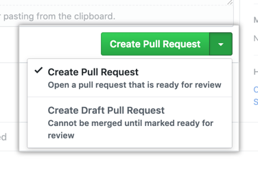

# Contributing Guidelines  
  
This documentation contains a set of guidelines to help you during the contribution process.   
We are happy to welcome all the contributions from anyone willing to improve/add new scripts to this project. Thank you for helping out and remember, No contribution is too small.

### General Rules :
These are in general rules that you should be following while contributing to an Open Source project :

- Be Nice, Be Respectful (BNBR)
- Check if the Issue you created, exists or not.
- Make proper commit messages and document your PR well.
- Always add Comments in your Code and explain it at points, if possible add Doctest.
- Always create a Pull Request from a Branch; Never from the Master.
- Follow proper code conventions because writing clean code is important.
- Issues would be served on a "First Come, First Serve" basis.
- Do mention (@maintainer) the project maintainer if your code PR isn't reviewed within 2 days.

# Submitting Contributions👩‍💻👨‍💻  
Below you will find the process and workflow used to review and merge your changes.  
## Step 0 : Identify what you want to contribute.
- If you want to add or change a major feature, create an issue and discuss with the maintainer what you would like to change.
- If you want to work on an Existing Issues or an Issue that you created, check if anyone is working on that issue.
- If no one is working on the issue, just comment and start working on it otherwise wait for the Issue to be assigned to you.


## Step 1 : Fork the Project  
- Fork this Repository. This will create a Local Copy of this Repository on your Github Profile. Keep a reference to the original project in `upstream` remote.  
```  
$ git clone https://github.com/<your-username>/<repo-name>  
$ cd Weather-app
$ git remote add upstream https://github.com/shelcia/Weather-app.git
```  


- If you have already forked the project, update your copy before working.  
```  
$ git remote update  
$ git checkout <branch-name>  
$ git rebase upstream/<branch-name>  
```  
## Step 2 : Branch 
Create a new branch. Use its name to identify the issue your addressing.  
```  
# It will create a new branch with name Branch_Name and switch to that branch 
$ git checkout -b branch_name  
```  

## Step 3 : Work Remotely  
- Now you are ready to your work to the remote repository.
### Environment Setup and Local Installation:
* Drop a :star: on the Github Repository.

* Download any IDE/ text editor, some of the recommended ones:
	[Install VS code](https://code.visualstudio.com/download)
	[Install Sublime text](https://www.sublimetext.com/3)

* Download [Node.Js](https://nodejs.org/en/download/)
or 
Run 
```
npm install
```

* Use this commands in your terminal for using the project.
```
npm start
```

* Open the project in your IDE/ text editor to use it.


## Step 4 : Work on the feature/ issue.  
- Add all the files/folders needed.  
- After you've made changes or made your contribution to the project add changes to the branch you've just created by:  
```  
# To add all new files to branch Branch_Name  
$ git add .  

# To add only a few files to Branch_Name
$ git add <some files>
```

## Step 5 : Commit  
- To commit give a descriptive message for the convenience of reviewer by:  
```
# This message get associated with all files you have changed  
$ git commit -m "message"  
```  

## Step 6 : Upload your changes   
- When your work is ready and complies with the project conventions, upload your changes to your fork:  
  
```  
# To push your work to your remote repository  
$ git push -u origin Branch_Name  
```  
- Here is how your branch will look in the fork.


## Step 7 : Pull Request  
- Go to your repository in browser and click on compare and pull requests. Then add a title and description to your pull request that explains your contribution.  
  
  

- Voila! Your Pull Request has been submitted and will be reviewed by the moderators and merged.🥳  

## Need more help?🤔  
You can refer to the following articles on basics of Git and Github and also contact the Project Mentors, in case you are stuck:  
- [Forking a Repo](https://help.github.com/en/github/getting-started-with-github/fork-a-repo)  
- [Cloning a Repo](https://help.github.com/en/desktop/contributing-to-projects/creating-an-issue-or-pull-request)  
- [How to create a Pull Request](https://opensource.com/article/19/7/create-pull-request-github)  
- [Getting started with Git and GitHub](https://towardsdatascience.com/getting-started-with-git-and-github-6fcd0f2d4ac6)  
- [Learn GitHub from Scratch](https://lab.github.com/githubtraining/introduction-to-github)  
  