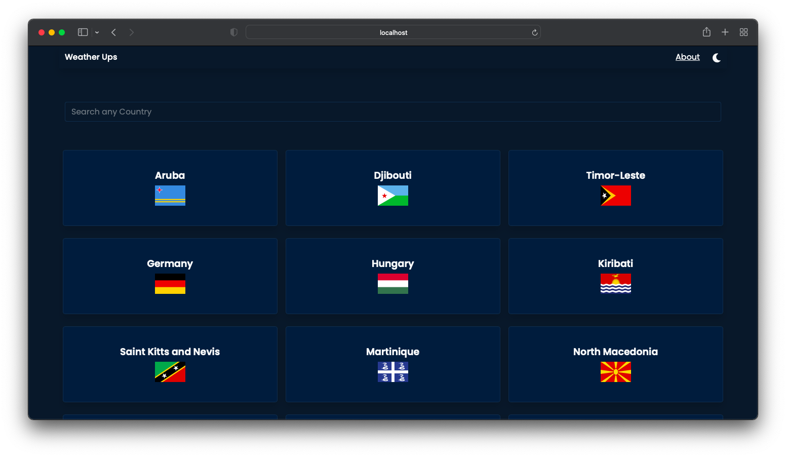
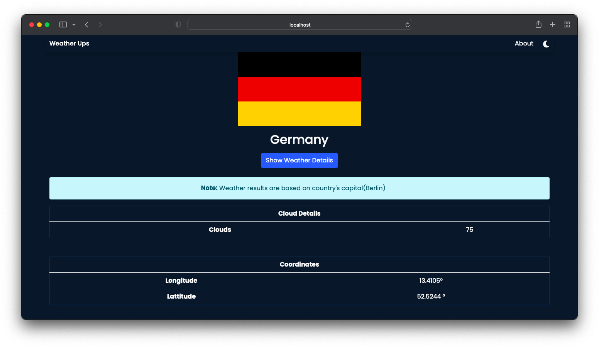
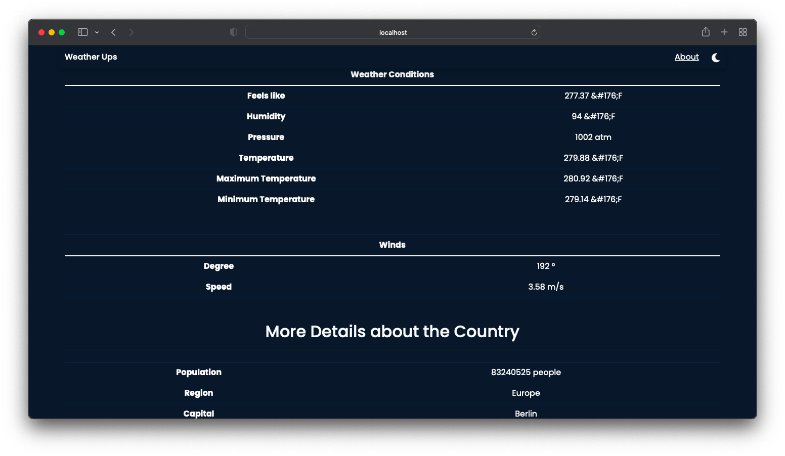

<h1>Weather App</h1>

  
  

  

  

<!-- ## Want to contribute ? Join our server (NWoC'20)

[Discord Server](https://discord.gg/TkKHAYVCza) -->

## Demo-

[Check out complete walkthrough of Weather app](https://vimeo.com/490218590)

### Resources used

Rest countries API: https://restcountries.com/

Open Weather API: https://openweathermap.org/api

### Deployed at

https://weatherups.netlify.app/

### To Use this repo for development

- Clone this repo

- Add .env file and create a variable name REACT_APP_API_KEY and add your api key (check open weather api docs)

- Then run <code>npm install</code>

- And finally <code>npm start</code>
